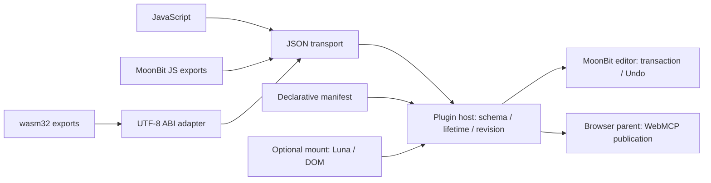

# 宣言的ペーンプラグイン API v1

ペーンは `manifest` でツールを宣言し、`invoke` で処理を提供する。ブラウザの親ホストがWebMCPへの公開と編集の確定を担当する。UI用の `mount` は任意で、同じプラグインを画面なしでも実行できる。

公開契約は [plugins.d.ts](../../editor/studio/public/plugins.d.ts)、ランタイムは [plugins/index.mjs](../../editor/studio/plugins/index.mjs)。初期実装ではJS、MoonBitのJS出力、wasm32の線形メモリABIを提供する。

## 構成



| 契約 | 責務 |
| --- | --- |
| `manifest` | プラグインID、表示名、ツール名、説明、入出力Schema、read/transaction |
| `transport.invoke(requestJSON, {signal})` | 言語境界。JSON文字列を受け、JSON文字列またはそのPromiseを返す |
| `mount(context)` | 任意のブラウザ表示。既存PaneContextを使い、同期の破棄関数を返せる |
| 親ホスト | 名前空間、入力と出力の検証、世代管理、キャンセル、編集コマンドのcommit |

ツールはプラグイン登録に結び付く。タブの切り替え・Close paneはUIをunmountするが、AIが利用するツールを消さない。UIを省略すると、ツール選択・JSON引数・実行結果を持つ標準ペーンを表示する。独自フォームは既存の `registerForm`、Luna UIは `mount` から接続する。

## Manifestと名前空間

```js
const manifest = {
  apiVersion: 1,
  id: 'mygame.combat',
  title: 'Combat tools',
  tools: [{
    name: 'set_damage',
    description: 'Set damage as an undoable game resource.',
    effect: 'transaction',
    inputSchema: {
      type: 'object',
      properties: { damage: { type: 'integer', minimum: 0, maximum: 999 } },
      required: ['damage'], additionalProperties: false,
    },
    outputSchema: { type: 'integer', minimum: 0, maximum: 999 },
  }],
};
```

親は `kagura.pane.mygame.combat.set_damage` として公開する。プラグイン自身は `document.modelContext` に触れない。

- `apiVersion` は1。プラグインIDは1〜80文字の英数字・`_ . -`。`console`、`creator`、`form.` 接頭辞は予約済み。
- ツール名は1〜32文字の英数字・`_ -`。ドットを許さず、ペーンIDとの区切りの衝突を防ぐ。同一manifest内の重複も拒否する。
- タイトルは空白のみを除く1〜120文字、説明は1〜1000文字。ホストあたり最大32プラグイン、各32ツール。
- `inputSchema` はobjectを表すJSON Schema draft-07、`outputSchema` は任意。Ajv strictモードで登録時にコンパイルし、型強制変換・デフォルト値追加・フィールド削除・非同期検証・外部Schema取得は行わない。`format` 拡張は同梱しない。
- manifestや応答の未知フィールドを拒否する。入力オブジェクトの追加フィールドは各Schemaで `additionalProperties: false` を指定して制限する。
- 登録時に宣言をコピー・凍結する。同じIDの更新は再登録する。新宣言の検証に失敗しても既存の登録を保持する。

WebMCP向け入力は親がラップする。上のツールへの引数は次の形になる。

```json
{"arguments":{"damage":42},"expectedRevision":0}
```

`read` のラッパーは `arguments` のみを持ち、`transaction` には `expectedRevision` が必須。`readOnlyHint` はeffectから親が決定し、`untrustedContentHint` はtrueにする。出力Schemaはプラグインの `result` に対して親が検証し、WebMCPには `{ok,result,revision}` を返す。

## 呼び出しと編集

言語共通のリクエスト:

```ts
type PluginRequest = {
  apiVersion: 1;
  tool: string;                  // 接頭辞を除いたツール名
  arguments: JsonObject;
  snapshot: Snapshot;            // 呼び出し開始時に一度取得したコピー
};
type PluginResponse = {
  result: JsonValue;
  commands?: Command[];
};
```

`read` は結果のみを返す。`commands` がある応答は拒否する。`transaction` は結果と1〜100個の既存コマンドを返す。プラグインが返したコマンドは親が `editor.dispatch({expectedRevision, commands})` へ渡し、MoonBitコアの検証を経て1つのUndo単位で確定する。保存は既存のSave/storage APIから別途行う。

親は呼び出し前とcommit時の両方でrevisionを確認する。処理中に人間の編集が進めば `conflict` を返し、古い提案を自動で再適用しない。選択・プレビュー時刻は呼び出し時のsnapshotを使う。これらはドキュメントrevisionを進めないので、選択変更後も当初の対象への提案として扱う。

JSONは有限数・文字列・真偽値・null・配列・オブジェクトのみ。メッセージはUTF-8で4 MiB以下、深さ64以下。DOM、関数、循環参照、言語固有オブジェクトは渡さない。SceneDocumentやResourceの制約は別途コアでも検証する。

成功は `{ok:true, result, revision}`。入出力Schemaやコマンドの不正は `invalid`、版競合は `conflict`、解除やabortは `canceled`、JSONデコード失敗などの実行例外は `plugin_error` を返す。登録自体の不正は例外を投げる。ツール宣言の説明や結果はゲーム由来のデータであり、エージェントへの上位指示ではない。

## JavaScript

```js
const plugin = kagura.plugins.defineJSPlugin({
  manifest,
  invoke({ arguments: args }) {
    return {
      result: args.damage,
      commands: [{ op: 'resource.put', resource: {
        id: 'combat.settings', kind: 'mygame.combat', version: 1,
        data: { damage: args.damage },
      } }],
    };
  },
  // mount({element, editor, subscribe, signal}) { ...; return cleanup; }
});
kagura.panes.registerPlugin(plugin);
kagura.panes.open(manifest.id);
await kagura.webmcp.settled(); // 動的な公開の完了を待つ
```

実行できる例は [js-demo.mjs](../../editor/studio/public/plugins/js-demo.mjs)。開発者コンソールで:

```js
const { install } = await import('/plugins/js-demo.mjs');
const uninstall = install(kagura);
await kagura.webmcp.settled();
console.log(await kagura.panes.invokeTool('demo.js', 'set_damage', { damage: 42 }, {
  expectedRevision: kagura.snapshot().revision,
}));
// uninstall(); // UI、ツール登録、進行中の呼び出しを破棄
```

JSハンドラーはPromiseと `options.signal` を使用できる。コードは信頼するプラグインとして実行する。JSON境界とeffectは整合性の契約であり、JSのグローバルアクセスや外部I/Oを隔離する仕組みではない。

## MoonBit

MoonBitのJS出力では、`manifest() -> String` と `invoke(String) -> String` をexportする。内部のADTやGCオブジェクトをABIへ露出させず、JSONを言語境界にする。

```js
const module = await import('/plugins/moonbit-demo.mjs');
kagura.panes.registerPlugin(kagura.plugins.fromJSONModule(module));
kagura.panes.open('demo.moonbit');
```

[実装](../../editor/studio/src/plugin_demo/main.mbt) と [export設定](../../editor/studio/src/plugin_demo/moon.pkg) は、ノード数を読む `count_nodes` と選択ノードの名前を編集する `rename_selected` を提供する。`just studio-build` / `just studio-plugin-test` で実際にコンパイルする。開発サーバーの起動時にも生成するが、デモソースの編集後は再ビルドして読み込み直す。

Lunaによる表示が必要な場合はJS側で `fromJSONModule(module, {mount})` に接続する。ツール部分はLunaやDOMをimportしなくてよい。MoonBitのWasmGC出力をこのwasm32 ABIへそのまま渡す対応は含めず、JS出力を動作確認済みの入口にする。

## Wasm ABI

線形メモリをexportするwasm32モジュールを `fromWasm(bytesOrModule)` で読み込む。host import、WASIは要求せず、現在のアダプターはimportを提供しない。ヘッダーは [kagura_plugin.h](../../editor/studio/plugins/kagura_plugin.h)。

| Export | 署名と意味 |
| --- | --- |
| `memory` | UTF-8バッファを置くWebAssembly.Memory |
| `kagura_alloc` | `(length:i32) -> pointer:i32`、入力用バッファ |
| `kagura_free` | `(pointer:i32, length:i32) -> void`、入力・結果の解放 |
| `kagura_manifest` | `() -> pointer:i32`、manifest JSON |
| `kagura_invoke` | `(requestPointer:i32, requestLength:i32) -> pointer:i32`、response JSON |
| `kagura_result_len` | `() -> length:i32`、直前のmanifest/invoke結果のバイト数 |

ポインターと長さはunsigned wasm32値として解釈する。文字列はNUL終端に依存せず、入力と結果のバッファは重ねない。親が入力を確保してコピーし、guest呼び出し後に結果長を取得し、結果をコピーしてから結果→入力の順にfreeする。静的領域を使うguestもfreeをexportし、その領域のfreeをno-opとして扱える。

親は範囲・メッセージサイズ・UTF-8・重複バッファを検証する。guest呼び出しによるmemory.grow後はビューを取得し直す。不正な結果ポインターや入力と重なる結果はfreeへ戻さず拒否する。

```js
const bytes = await (await fetch('/plugins/wasm-demo.wasm')).arrayBuffer();
kagura.panes.registerPlugin(await kagura.plugins.fromWasm(bytes));
kagura.panes.open('demo.wasm');
```

[WATソース](../../editor/studio/examples/plugins/wasm-demo.wat.in) と [manifest](../../editor/studio/examples/plugins/wasm-demo.manifest.json) をwabtで実バイナリへビルドする。デモは受け取ったリクエストを結果として返し、日本語やメモリ拡張を検証できる。生成された `.wasm` はbuild成果物として配信する。

このABIのguest実行は同期。AbortSignalは遅れて返る結果のcommitを防げるが、同期JS/Wasmの無限ループを中断できない。計算時間制限や強制停止が必要な拡張は、同じJSON transportをWorker等の隔離実行へ接続する。WasmGC・Component Model/WIT・ストリーミング応答・guestからの非同期host呼び出しはv1には含めない。

## ライフサイクルとWebMCP公開

同じIDで再登録すると旧世代をabort・disposeし、宣言ごと置換する。transportの寿命は登録先ホストが所有するため、差し替えや別ホストへの登録には新しいプラグインインスタンスを作る。古いWebMCPコールバックを保持していても、親ホストが世代を照合して拒否する。呼び出し元のAbortSignal、プラグイン解除、親の破棄を合成し、キャンセル後に返ったPromiseの結果をcommitしない。ビュー起点の実行にはmountのsignalも渡し、非表示になったビューからの遅い変更を防ぐ。

ブラウザの親は各登録のAbortSignalを所有し、削除・変更したツールだけ解除する。新旧登録が同名の場合も旧登録を解除してから新宣言を公開する。非同期の登録途中で差し替え・破棄が起きた場合も旧登録を残さない。

ブラウザによる1件の宣言の拒否は `kagura.webmcp.status().pluginErrors` に記録し、既存の基本ツールや他プラグインを維持する。`webmcp.ready` は初期公開、`webmcp.settled()` はその時点までに要求した動的公開の完了を待つ。WebMCP非対応でも `panes.invokeTool()` とNodeホストは動く。

プラグインコードの自動保存・自動再実行は行わない。ゲーム起動コードで必要なプラグインを登録し、永続データは `document.resources` に置く。IndexedDB / File System / Worker R2 / URLから取得したWasmも、そのバイト列を `fromWasm()` へ渡せる。リソースのダウンロードとプラグイン登録は別の明示的な操作にする。

## ヘッドレスと検証

```js
import { createHeadlessEditor } from './editor/studio/headless/index.mjs';
import { createPluginHost, defineJSPlugin } from './editor/studio/plugins/index.mjs';
import * as game from './editor/studio/public/plugins/js-demo.mjs';
const editor = createHeadlessEditor();
const plugins = createPluginHost(editor);
plugins.register(defineJSPlugin(game));
console.log(await plugins.invoke('demo.js', 'set_damage', { damage: 42 }, {
  expectedRevision: editor.snapshot().revision,
}));
plugins.dispose();
```

NodeのホストはWebMCPやmountを使わず同じ検証・commitを実行する。既存JSONL CLIへプラグイン読込コマンドは追加せず、Node SDKを接続点にする。

`just studio-plugin-test` は実JS・MoonBit JS・Wasmの実行、入出力検証、Undo、競合、世代交代、Wasmメモリ境界、WebMCP公開の失敗と破棄を確認する。`just studio-ci` では型・MoonBit・Nodeに加え、実ChromiumのWebMCPで検出・呼び出し・UI編集・閉じる・差し替え・解除、既存のエディタ回帰とWorker dry-runも検証する。

設計時に参照: [Chrome WebMCP命令型API](https://developer.chrome.com/docs/ai/webmcp/imperative-api?hl=ja)、[Ajv Schema管理](https://ajv.js.org/guide/managing-schemas.html)、[WebAssembly.Memory](https://developer.mozilla.org/en-US/docs/WebAssembly/Reference/JavaScript_interface/Memory)（2026-09-10確認）。
