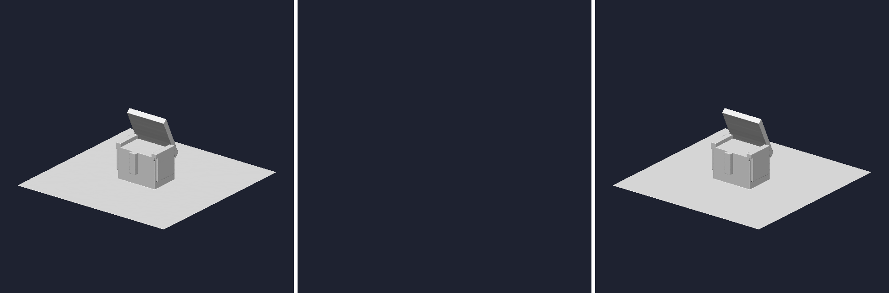

# meshoptimizer によるメッシュ圧縮の検証

[meshoptimizer](https://github.com/zeux/meshoptimizer) を kagura のメッシュに使えるかを確かめた。次の 2 つを測っている。

1. glTF のまま圧縮する場合: `gltfpack` で GLB を `KHR_mesh_quantization` / `EXT_meshopt_compression` 付きに変換する
2. Iron Yard の配信形式に組み込む場合: `scripts/convert-assets.mjs` が作るバッチ（頂点ごとに position3 / normal3 / uv2 の float）を meshopt コーデックで符号化する

```bash
just iron-yard-meshopt          # 2 の表を再生成する（約 30 秒）
node examples/games/iron_yard/experiments/meshopt/bench.mjs --json
```

このスクリプトは測定結果を出すだけで、ゲートにはしていない。本番のローダーは今も `assets/generated/*.json` を読む。

測定条件: 2026-09-26、Linux コンテナ、Node 22.22、npm `meshoptimizer@1.3.0` / `gltfpack@1.3.0`（ソースからビルドした gltfpack 1.3 と出力バイトが一致）。gzip は level 9、brotli は quality 11（Node の zlib）。

## 結論

- **エンジンは `EXT_meshopt_compression` をまだ読めない。** normalized 整数の accessor（下の「組み込む場合の作業」の 1）は対応済みで、gltfpack の既定の出力（`KHR_mesh_quantization`）は `scene_graph_from_gltf` / `skinned_scene_from_gltf` で読める。`-c` の出力は復号器が無いので読めない。`convert-assets.mjs` は今も `normalized` を無視するため、strix の `-noq` 出力は `Expected rigid one-bone skin` で落ちる（weight 1.0 が 255 と読まれる）。量子化あり・`-c` の出力は `Unsupported component type` / `Unsupported accessor` で落ちる
- **効果の大半はコーデックではなく量子化による。** 配信を brotli で圧縮するなら、量子化しただけの生バイナリのほうが meshopt 符号化より小さかった（下の表 2）。meshopt コーデックが勝ったのは gzip の場合と、圧縮しない raw サイズの場合だけ
- **大きなメッシュでは効果がはっきり出る。** 29 万頂点 / 47 万三角形の trellis チェストは 15,100 KiB → `-c` で 2,550 KiB（brotli 後は 7,425 KiB → 2,086 KiB）。この規模では brotli を通しても `-c` が量子化のみ（3,011 KiB）より小さい
- **デコードは速い。** strix / bastion の全バッチを JS で float に戻すまで含めて 1〜2 ms。現状の geometry JSON の `JSON.parse`（5.6 ms / 17.9 ms）より速い。ただし実際の起動では JS の配列を再び `JSON.stringify` して MoonBit 側でもう一度 parse しているので、ここは別に測る必要がある
- **可逆モードはビット一致する。** 量子化モードの誤差は、位置がバッチ AABB 対角線の 7.6e-6、法線が 8bit で最大 0.97°、12bit で 0.05°、UV が 2.4e-5

## 1. gltfpack（GLB → GLB）

`gltfpack -i in.glb -o out.glb <mode> -kn -km -ke`。セルは raw / gzip / brotli（KiB）。

| model | 元の GLB | `-noq` | 既定（量子化） | `-c` | `-cc` |
|---|---|---|---|---|---|
| strix | 1810.8 / 177.0 / 87.1 | 914.9 / 78.9 / 52.8 | 845.8 / 69.2 / 45.0 | 377.0 / 65.6 / 53.3 | 364.5 / 58.8 / 47.1 |
| bastion | 1035.3 / 263.2 / 72.9 | 558.1 / 76.6 / 55.5 | 458.9 / 65.8 / 46.0 | 353.6 / 65.2 / 55.7 | 349.2 / 63.4 / 54.3 |
| RiggedFigure | 48.9 / 14.5 / 11.6 | 20.4 / 9.2 / 7.4 | 16.8 / 8.0 / 6.4 | 13.5 / 7.5 / 6.7 | 13.2 / 7.0 / 6.3 |
| trellis chest | 15100.4 / 9269.3 / 7425.3 | 15100.1 / 8874.8 / 6874.9 | 10530.0 / 4302.3 / 3011.4 | 2549.5 / 2166.8 / 2086.2 | 2445.6 / 1981.2 / 1905.7 |

- trellis chest は `examples/experimental/fal_trellis_demo/assets/generated/gltf-viewer-proxy-chest-trellis.glb`。490 KB の WebP テクスチャを含み、gltfpack はテクスチャに手を付けていない（`-tc` 未使用）
- `-noq` でも strix / bastion は元の約半分になる。内訳は測っていない。gltfpack は量子化とは別に、重複データや未使用データの削除、アニメーションの再サンプリングも行い、`-noq` でも weight を 8bit にする
- 出力の `extensionsRequired` は、既定が `KHR_mesh_quantization`、`-c` がそれに加えて `EXT_meshopt_compression`。量子化後の accessor には `BYTE` / `UNSIGNED_BYTE` / `SHORT` の normalized が並ぶ
- 小さいモデルでは brotli 後の `-c` が量子化のみより大きい。表 2 と同じ傾向

## 2. Iron Yard のバッチを符号化する

`convertGLB` の出力をそのまま入力にし、バッチごとに `reorderMesh`（頂点キャッシュ + フェッチ順）を適用してから符号化した。サイズは KiB。

strix: 103 バッチ、11,572 頂点（参照されているのは 11,564）、18,972 index

| 形式 | raw | gzip | brotli | デコード ms | 可逆 | 位置誤差 / 対角線 | 法線 ° | UV |
|---|---:|---:|---:|---:|---|---:|---:|---:|
| 現状の JSON（アセット全体） | 1814.2 | 257.1 | 98.3 | | | | | |
| JSON のうちジオメトリ以外 | 861.0 | 136.9 | 41.3 | | | | | |
| JSON のうちジオメトリ | 951.4 | 117.9 | 56.1 | | | | | |
| float32 + uint32 バイナリ | 435.7 | 91.4 | 37.4 | | | | | |
| 量子化のみ（コーデックなし） | 254.8 | 49.2 | **25.3** | | | | | |
| meshopt 可逆 (v0) | 224.4 | 68.8 | 59.1 | 0.83 | yes | 0 | 0 | 0 |
| meshopt 可逆 (v1, level 3) | 193.0 | 71.3 | 61.0 | 0.61 | yes | 0 | 0 | 0 |
| meshopt 量子化（法線 8bit） | **112.2** | **42.4** | 37.5 | 1.19 | no | 7.4e-6 | 0.95 | 1.6e-5 |
| meshopt 量子化（法線 12bit） | 118.7 | 47.8 | 41.3 | 1.04 | no | 7.4e-6 | 0.05 | 1.6e-5 |

bastion: 43 バッチ、35,028 頂点、45,630 index

| 形式 | raw | gzip | brotli | デコード ms | 可逆 | 位置誤差 / 対角線 | 法線 ° | UV |
|---|---:|---:|---:|---:|---|---:|---:|---:|
| 現状の JSON（アセット全体） | 3117.9 | 332.9 | 186.0 | | | | | |
| JSON のうちジオメトリ以外 | 178.0 | 13.8 | 12.3 | | | | | |
| JSON のうちジオメトリ | 2939.2 | 314.1 | 172.4 | | | | | |
| float32 + uint32 バイナリ | 1272.9 | 270.5 | 130.3 | | | | | |
| 量子化のみ（コーデックなし） | 725.6 | 180.2 | **83.5** | | | | | |
| meshopt 可逆 (v0) | 618.0 | 283.3 | 223.5 | 1.47 | yes | 0 | 0 | 0 |
| meshopt 可逆 (v1, level 3) | 530.9 | 282.5 | 228.4 | 1.05 | yes | 0 | 0 | 0 |
| meshopt 量子化（法線 8bit） | **301.9** | **146.7** | 127.0 | 1.77 | no | 7.6e-6 | 0.97 | 2.4e-5 |
| meshopt 量子化（法線 12bit） | 319.8 | 155.3 | 134.4 | 1.99 | no | 7.6e-6 | 0.05 | 2.4e-5 |

量子化は gltfpack と同じ分け方にした。位置はバッチ AABB 上の uint16（パディング込み 8 バイト）、法線は octahedral フィルタ（8bit で 4 バイト、12bit で 8 バイト）、UV は値域上の uint16。1 頂点 32 バイトが 16 バイトになる。

検証していること:

- `reorderMesh` の前後で三角形の集合（頂点値の組、角の回転は同一視）が float32 化した元データと一致すること
- 復号した index が三角形ごとに元の角の回転になっていること。index コーデックは巻き方向を保ったまま角を回転させることがあるので、位置の一致ではなく回転で比べている
- 可逆モードでは全ての角の全属性が `Object.is` で一致すること

デコード時間は 9 回の中央値で、wasm の `MeshoptDecoder` に加えて JS で float に戻すループを含む。バッチ数が多いと呼び出しごとの `sbrk` とコピーの割合が大きくなるので、1 つのバッファにまとめれば短くなる見込み。ただしこれは未測定。

### 読み方

- **strix はジオメトリ以外が半分近い。** 861 KB はアニメーションクリップ（`times` / `values`）。meshopt にはクォータニオン用のフィルタ（`encodeFilterQuat`）と指数フィルタがあり、gltfpack の `-c` はアニメーションも圧縮しているが、このスクリプトは測っていない
- **brotli ではコーデックが逆効果になる。** strix で 25.3 → 37.5 KiB、bastion で 83.5 → 127.0 KiB。変換時にワールド変換を焼き込んでいるので、同じ部品の繰り返しが brotli の長い窓では見つかるが、meshopt の頂点コーデック（直前の頂点との差分）では見つからない、というのが考えられる理由。ただしこれは確かめていない
- **gzip ではコーデックが効く。** bastion で 180.2 → 146.7 KiB、strix で 49.2 → 42.4 KiB。どちらを採るかは配信経路の `Content-Encoding` で決まる

## 組み込む場合の作業

エンジンで使えるようにするには、軽い順に次の作業が要る。

1. **normalized 整数の accessor を読む（対応済み）。** `read_accessor_floats` が `BYTE` / `UNSIGNED_BYTE` / `SHORT` / `UNSIGNED_SHORT` を読み、`normalized` なら glTF 2.0 の規則で float に戻す。`KHR_mesh_quantization` が許す normalized でない整数はそのまま値として返す
2. **`KHR_mesh_quantization` の残り。** 位置のデクオンタイズは gltfpack がノードの TRS に移すので、1 だけでシーングラフとしては正しい位置に出る（下の画像）。ただしノードを無視して頂点をまとめる `mesh_from_gltf` / `meshes_from_gltf` ではスケールが戻らない。UV のデクオンタイズは `KHR_texture_transform` に移るが、これはまだ読んでいない
3. **`EXT_meshopt_compression`。** bufferView の拡張から圧縮済み範囲を読み、`ATTRIBUTES` / `TRIANGLES` / `INDICES` モードと `OCTAHEDRAL` / `QUATERNION` / `EXPONENTIAL` / `COLOR` フィルタを復号して、元の bufferView のバイト列を作る。復号後は 1 と 2 の経路に流れる

### 量子化済み GLB の読み込み（1 の確認）

trellis チェスト（467,523 三角形）を `engine/gltf` の `scene_graph_from_gltf` で読み、ノードのワールド変換を掛けた三角形を z バッファ + Lambert で CPU ラスタライズした。これは確認用の描画で、kagura のレンダラーの出力ではない。法線は頂点法線の平均で陰影を付けているので、法線の復号結果が画に出る。



| | 入力 | 結果 |
|---|---|---|
| 左 | 元の GLB（15,100 KiB、FLOAT） | 467,523 三角形。変更の前後で出力バイトが一致 |
| 中 | `gltfpack` 既定（10,530 KiB、`POSITION` が `UNSIGNED_SHORT`、`NORMAL` が normalized `BYTE`、`TEXCOORD_0` が normalized `UNSIGNED_SHORT`）を変更前に読んだもの | `UnsupportedComponentType` で何も読めない |
| 右 | 同じファイルを変更後に読んだもの | 467,523 三角形。左と比べて前景 67,411 px のうち 21,867 px が変わるが、21,790 px は 2/255 以下（法線の 8bit 化）で、2/255 を超えるのは 77 px（位置の 16bit 化による輪郭の揺れ） |

スキン付きの読み込み（`skinned_scene_from_gltf`）も確かめた。`MAT4` の accessor を 1 要素として数えていたので、逆バインド行列を持つファイルは量子化と関係なく落ちていた。

| ファイル | 変更前 | 変更後 |
|---|---|---|
| `RiggedFigure.glb`（元） | panic（`MAT4` の要素数） | 370 頂点、19 ボーン、クリップ 1 |
| `RiggedSimple.glb`（元） | panic（`MAT4` の要素数） | 160 頂点、2 ボーン、クリップ 1 |
| `RiggedFigure` の `gltfpack -noq` | panic | 316 頂点、weight の合計と 1 の差の最大値 1.1e-16 |
| `RiggedFigure` の `gltfpack` 既定 | `UnsupportedComponentType` | 312 頂点、weight の合計と 1 の差の最大値 1.1e-16 |

3 のデコーダをどこに置くかは 2 通りある。

- **MoonBit に移植する。** 参照実装 `meshopt_decoder_reference.js` は 472 行で、SIMD を使わないスカラー実装。移植すれば js / native / wasm で同じコードが動き、「コアロジックは MoonBit」という方針にも合う。速度は wasm SIMD 版より落ちるはずなので、移植したら別に測ること
- **JS の `MeshoptDecoder`（wasm）を host 側で呼ぶ。** `meshopt_decoder.mjs` は 29 KB（gzip 7.5 KB）。Web ではすぐ使えるが native には無いので、native 用には別に C の `meshoptimizer` を FFI でリンクすることになる

Iron Yard だけに限るなら、glTF の拡張は要らない。`convert-assets.mjs` の出力を「メタデータの JSON + 量子化済みの頂点バイナリ」に分けるだけで、brotli 後のジオメトリは strix で 56.1 → 25.3 KiB、bastion で 172.4 → 83.5 KiB になる。meshopt コーデックを入れるかどうかは配信の圧縮方式を確かめてから決める。
